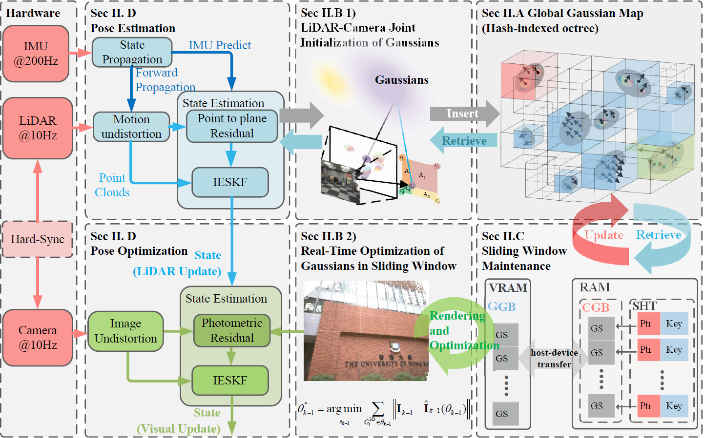
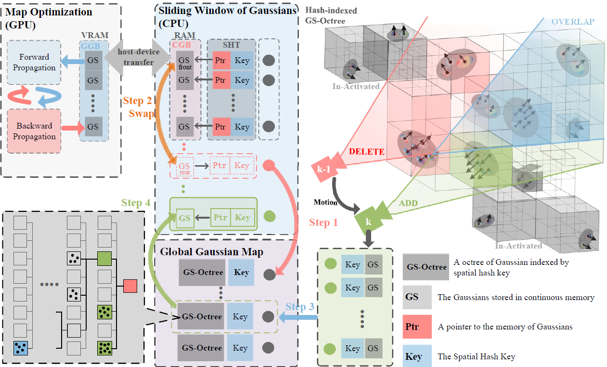

# GS-LIVO DemoPage
Project Page: [gs-livo.tech](https://gs-livo.tech) (coming soon)

This repository shows the experimental results of our GS-LIVO system running on various public datasets and real-world scenarios.

## System Overview and Principles

GS-LIVO (Gaussian Splatting LiDAR-Inertial-Visual Odometry) is a novel SLAM framework that seamlessly integrates LiDAR, inertial, and visual sensors. The system comprises four key modules:

1. **Global Gaussian Map**: A spatial hash-indexed octree structure that efficiently covers sparse spatial volumes while adapting to various environmental details and scales. This structure enables effective management of large-scale environments with minimal memory overhead.

2. **Gaussian Initialization and Optimization**: The system performs rapid initialization of Gaussians using both LiDAR and visual information, followed by online optimization using photometric gradients. This dual-sensor approach ensures robust and accurate scene representation.

3. **Sliding Window Management**: To maintain real-time performance, GS-LIVO employs an innovative sliding window approach for Gaussian maintenance. This includes:
   - Efficient memory management between CPU and GPU
   - Incremental updates to avoid redundant computations
   - Strategic handling of Gaussians entering and leaving the field of view

4. **State Estimation**: The system utilizes an Iterated Extended Kalman Filter (IESKF) with sequential updates, tightly integrating LiDAR and image measurements. Unlike traditional patch-based methods, GS-LIVO achieves seamless rendering with high visual quality.

Key advantages of our approach include:
- Seamless integration of multiple sensor modalities
- Efficient memory management through sliding window optimization
- High-quality scene representation using Gaussian splatting
- Real-time performance on both high-end GPUs and edge computing devices

---

---

## Hardware & Platform Clarification
- **Car Platform & Handheld Platform**: Tested on **Jetson Orin NX (16GB)**
- **Other Datasets (MARS-LVIG, Landmark, UAV, HKU)**: Tested on a **PC with NVIDIA RTX 4090**

---

## Results on MARS-LVIG Dataset
> *These results were produced on PC with NVIDIA RTX 4090.*

### SLAM Process

### SLAM Output Results

---

## Results on Landmark Dataset
> *These results were produced on PC with NVIDIA RTX 4090.*

### SLAM Process

### SLAM Output Results

---

## Results on UAV Playground Dataset
> *These results were produced on PC with NVIDIA RTX 4090.*

### SLAM Process

### SLAM Output Results

---

## Results on FAST-LIVO HKU Dataset
> *These results were produced on PC with NVIDIA RTX 4090.*

### SLAM Process
<!-- HKU1 原始大小 100%，不做缩放 -->

### SLAM Output Results

---

## Vehicle Implementation
> *Tested on Jetson Orin NX (16GB).*

Implementation of GS-LIVO on a real vehicle with A* LQR path planning:

---

## Edge Computing Deployment
> *Tested on Jetson Orin NX (16GB).*

Real-time deployment on Jetson Orin NX 16GB:

